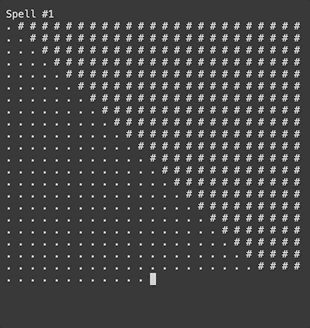

# Harry Potter Square

`npm run start:spells`

## Spells

01: `x < y`  
02: `x: y === 0`  
03: `24: (x + y) === 0`  
04: `x: 5 < 25: y`  
06: `!(x >= 10 && y >= 10)`  
07: `x > 15 && y >= 15`  
08: `x === 0 || y === 0`  
09: `Math.abs(x: y) > 10`  
011: `1: x === 0 || 1: y === 0 || x === 23 || y === 23`  
012: `Math.sqrt((0: x) ** 2 + (0: y) ** 2) < 20`  
023: `x % 3 === 0 && y % 2 === 0`  
025: `x % 6 === 0 || y % 6 === 0`

